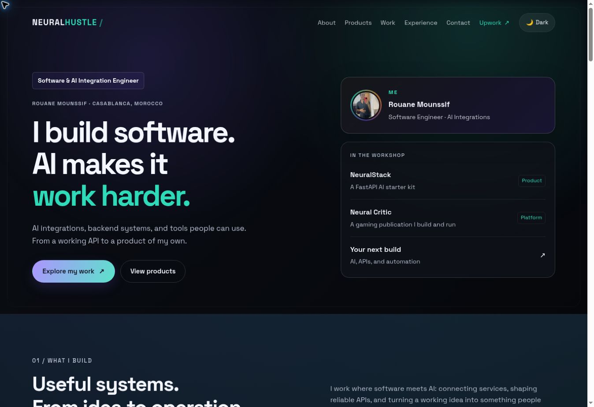
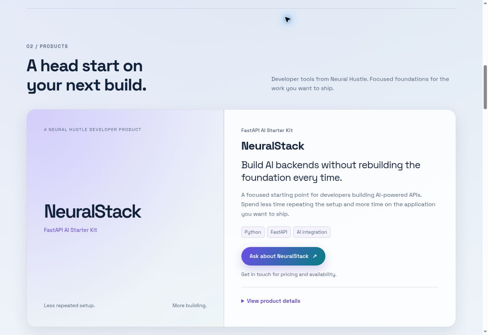
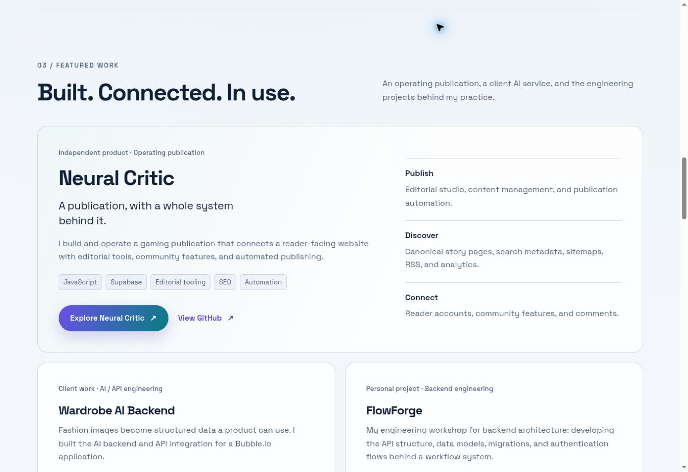

# Neural Hustle redesign — audit and verification

> This documents the first redesign baseline. See [the follow-up polish report](POLISH_REPORT.md) for the connected Gumroad URL, final refinements, and updated screenshots.

Prepared 10 September 2026 from main at 0b357f3777796dff76738465dff8b412e2b3f42b.

## Audit completed before implementation

Original order: Hero → About/Upwork → Experience/education/certifications → Academic Projects → Courcify Courses → GitHub Projects → YouTube → Contact → Footer.

Original navigation: About, Courses, Projects, Portfolio, Upwork, Videos, Contact.

| Area | Owner and finding |
| --- | --- |
| Sections/cards | index.html; hand-authored static HTML |
| Styling | styles.css plus inline theme-toggle/reveal styles |
| Profile | Inline shared-element state machine, reverse animation, explicit-close suppression, backdrop and touch history |
| Themes | html.light, body data-theme, CSS tokens, localStorage and Vanta updates |
| Navigation/responsiveness | Inline menu toggles; CSS grids and 900px/720px breakpoints |
| Motion | IntersectionObserver, Web Animations API, CSS animations, Vanta/Three.js |
| Contact | FormSubmit; return URL still used the old domain |
| Copilot | D-ID loader, configuration and draggable support |
| Search presentation | Canonical/social image existed; descriptions emphasized courses |
| Obsolete promotions | Courses navigation, cohort/tutorial hero CTAs, three Coursify cards, Academy footer link, old metadata/README |
| Claims | Repository did not substantiate 12+ clients, 40+ integrations, or 100+ creative outputs |
| Gumroad | No product URL or NeuralStack cover found in current files or fetched remote branches |
| Project destinations | Neural Critic public; FlowForge and Wardrobe private |

Existing external links/services: Upwork, Wardrobe and SoraAgent GitHub, Coursify, NeuralFC, Ainimal, LinkedIn, the old Academy site, Gmail compose, FormSubmit, Google Fonts, Font Awesome, Vanta/Three.js, and D-ID.

Risks identified: profile state/closing regressions, light-theme leakage, stale anchors, unsupported metrics, private GitHub links, and fabricated purchase destinations.

## Proposal made before editing

Introduction → What I build → Products → Featured work → Professional services → Experience and earlier work → Education/certifications → Creative work → Contact.

NeuralStack receives a dedicated product feature. Neural Critic leads engineering credibility. Wardrobe and FlowForge support it; a compact NeuralStack reference links back to Products. Space Grotesk, dark surfaces, purple/teal accents, the portrait, and motion remain.

## Final report

| Requested item | Result |
| --- | --- |
| 1. Files changed | index.html, styles.css, README.md; new studio.css, content/catalog.json, scripts/render_catalog.py, package.json/lockfile, vite.config.mjs, .gitignore, this report, review images |
| 2. Removed | Courcify commercial section, outdated SoraAgent feature, unsupported hero metrics, redundant third YouTube chooser |
| 3. Moved | Upwork follows current work; experience, earlier projects and credentials move lower; creative work is near the footer |
| 4. Redesigned | Hero, About, Products, Work, services, history, credentials, creative links, contact, navigation and footer |
| 5. Products | JSON → validated static HTML; details disclosure, optional cover/price, contact fallback until the real Gumroad link is supplied |
| 6. Featured work | Large Neural Critic feature; supporting Wardrobe/FlowForge; compact NeuralStack engineering reference |
| 7. Navigation | About, Products, Work, Experience, Contact, Upwork; logo home link, skip link, Escape/outside-click closing and hidden-menu focus protection |
| 8. Responsive/themes | Five widths in both themes passed overflow checks; 320px at 200% text repaired and verified |
| 9. Preserved | Profile geometry/hover/reverse close, backdrop, theme preference, reveals, Vanta, FormSubmit, Upwork/social links, D-ID configuration, favicon/canonical/social image |
| 10. Information needed | Exact NeuralStack Gumroad product URL. Optional verified price/cover; public case-study links for private projects if desired |

## Verification

| Check | Evidence / limitation |
| --- | --- |
| 1920, 1366, 820, 390, 320px × dark/light | Real CSS iframe viewports; no header/main/footer horizontal overflow; document width equaled client width |
| 320px / 200% text | Navigation and profile wrapping fixed; no horizontal overflow |
| Profile | Keyboard opening, Tab containment, close button, Escape, background unlock and focus return checked |
| Mobile menu | Open/close, ARIA state, Escape/focus restoration and Products navigation checked |
| Product details | Native disclosure opens and exposes detail content |
| Links/assets | Unique IDs, all fragment targets, local assets and external-link rel attributes checked |
| JavaScript | Inline syntax valid; optional Vanta/WebGL and localStorage failures guarded |
| Catalog | Output current; missing-link fallback, escaping and unsafe URL rejection checked |
| Contact | Required fields and invalid-email detection checked without sending. Existing recipient/action retained; current-domain return URL verified in source |
| Public destinations | Neural Critic site/GitHub, LinkedIn and both YouTube channels returned HTTP 200 |
| Upwork | Existing URL preserved; automated HTTP check returned 403 |
| Console | No site-script exception observed; browser-extension metadata errors occurred in the automation environment |
| Copilot | Loader/configuration and draggable code retained; widget presence observed. Voice/chat delivery not exercised |

Controlled browser widths do not substitute for physical touch-device testing. Touch history handling remains in the original state machine. FormSubmit delivery and Gumroad checkout were not exercised.

## Content choices

Unsupported counts became named current work. Experience dates and credential names were preserved. Conflicting duplicate year badges on earlier projects were removed rather than replaced with invented dates.

FlowForge remains an ongoing personal project. NeuralStack copy uses the supplied scope without invented modules, price, license, sales or implementation guarantees. Private GitHub destinations became useful contact links.

Old #courses/#portfolio anchors remain compatible, with Products/Work as visible labels. No domain, hosting, or repository visibility change was made.

## Review images

These show the implemented page.

